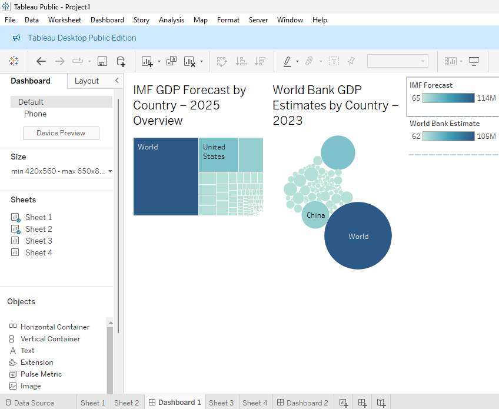

# 🌍 Global GDP Data Scraper & Cleaner

This project scrapes the **List of countries by GDP (nominal)** from Wikipedia, cleans the data, and saves it as a clean `.csv` and `.xlsx` file for analysis.

> 📊 Ideal for Tableau, Excel, Python analytics, and more!

---

## 📷 Screenshots

| Wikipedia Table Source | Cleaned Output Preview |
|------------------------|------------------------|
|  |  |

---

## 🧠 Features

- 🌐 Scrapes the latest GDP data from [Wikipedia](https://en.wikipedia.org/wiki/List_of_countries_by_GDP_(nominal))
- 🧹 Cleans messy formatting, removes citations like `[1]`, and drops nulls
- 📁 Saves clean data to:
  - `cleaned_data.csv`
  - `cleaned_data.xlsx`
- 💡 Supports direct import into Tableau and Excel

---

## 🛠️ Technologies Used

- `Python`
- `pandas`
- `BeautifulSoup`
- `requests`
- `re` (regex)
- `openpyxl` (for Excel output)

---

## 📂 How to Run

### 1. Install Requirements
```bash
pip install pandas requests beautifulsoup4 lxml openpyxl

```
# 🌍 Global GDP Visualization Project

This project presents two interactive Tableau dashboards based on GDP data for various countries. The dashboards provide insight into **IMF forecasts** for 2025 and **World Bank estimates** for 2023.

---

## 📊 Tableau Dashboards Overview

Two dashboards were developed using Tableau Public Desktop to visualize global economic data:

---

### 🧱 Dashboard 1: IMF Heatmap & World Bank Bubbles



#### 📌 Description:
This dashboard combines a **heatmap** of IMF GDP forecasts for 2025 and a **packed bubble chart** of World Bank GDP estimates for 2023.

#### 📈 Key Insights:
- The **heatmap** highlights the relative GDP forecast per country based on color intensity.
- The **bubble chart** visually compares countries’ GDPs based on the World Bank’s estimates, emphasizing scale using size and color.

#### 🛠️ Components:
- **Sheet 1: Heatmap**
  - Columns: `Country/Territory`
  - Rows: `IMF Forecast`
  - Marks: `Square`
  - Color: `IMF Forecast`

- **Sheet 2: Packed Bubbles**
  - Marks: `Circle`
  - Size: `World Bank Estimate`
  - Color: `World Bank Estimate`
  - Label: `Country/Territory`

---

### 🌐 Dashboard 2: Area Charts of IMF & World Bank Estimates


#### 📌 Description:
This dashboard displays two **area charts** side by side — one for IMF forecasts and one for World Bank estimates — allowing for a comparative trend view of GDPs across countries.

#### 📈 Key Insights:
- Visualizes the distribution of GDP data across countries in 2025 (IMF) and 2023 (World Bank).
- Offers clear comparison through shape and color shading.

#### 🛠️ Components:
- **Sheet 3: Area Chart – IMF Forecast**
  - Columns: `Country/Territory`
  - Rows: `IMF Forecast`
  - Marks: `Area`
  - Tooltip: Enabled for values

- **Sheet 4: Area Chart – World Bank Estimate**
  - Columns: `Country/Territory`
  - Rows: `World Bank Estimate`
  - Marks: `Area`
  - Tooltip: Enabled for values

---

## 📂 Sheet Summary

| Sheet Name | Visualization Type | Data Used | Axes / Encoding |
|------------|---------------------|-----------|-----------------|
| Sheet 1    | Heatmap             | IMF Forecast | X: Country, Y: IMF Forecast, Color: IMF |
| Sheet 2    | Packed Bubbles      | World Bank Estimate | Size & Color: Estimate |
| Sheet 3    | Area Chart          | IMF Forecast | X: Country, Y: Forecast |
| Sheet 4    | Area Chart          | World Bank Estimate | X: Country, Y: Estimate |

---

## 🔧 Tools & Data

- **Visualization Tool:** Tableau Public Desktop
- **Data Format:** Cleaned CSV file
- **Fields Used:** `Country`, `IMF Forecast`, `World Bank Estimate`, `Year`
- **Interactivity:** Tooltips and visual hierarchy for detailed exploration

---


