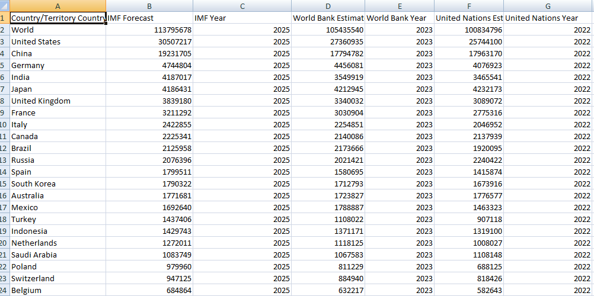

# 🌍 Global GDP Data Scraper & Cleaner

This project scrapes the **List of countries by GDP (nominal)** from Wikipedia, cleans the data, and saves it as a clean `.csv` and `.xlsx` file for analysis.

> 📊 Ideal for Tableau, Excel, Python analytics, and more!

---

## 📷 Screenshots

| Wikipedia Table Source | Cleaned Output Preview |
|------------------------|------------------------|
|  |  |

---

## 🧠 Features

- 🌐 Scrapes the latest GDP data from [Wikipedia](https://en.wikipedia.org/wiki/List_of_countries_by_GDP_(nominal))
- 🧹 Cleans messy formatting, removes citations like `[1]`, and drops nulls
- 📁 Saves clean data to:
  - `cleaned_data.csv`
  - `cleaned_data.xlsx`
- 💡 Supports direct import into Tableau and Excel

---

## 🛠️ Technologies Used

- `Python`
- `pandas`
- `BeautifulSoup`
- `requests`
- `re` (regex)
- `openpyxl` (for Excel output)

---

## 📂 How to Run

### 1. Install Requirements
```bash
pip install pandas requests beautifulsoup4 lxml openpyxl

```
# 🌍 Global GDP Visualization Project

This project presents two interactive Tableau dashboards based on GDP data for various countries. The dashboards provide insight into **IMF forecasts** for 2025 and **World Bank estimates** for 2023.

---

## 📊 Tableau Dashboards Overview

Two dashboards were developed using Tableau Public Desktop to visualize global economic data:

---

### 🧱 Dashboard 1: IMF GDP Forecast by Country – 2025 Overview


#### 📌 Description:
This dashboard uses a **treemap** to visualize GDP forecasts provided by the **International Monetary Fund (IMF)** for the year 2025. Each rectangle represents a country or region, and its size corresponds to the projected GDP value.

#### 📈 Key Insights:
- The **World** aggregate provides a full-scale reference.
- Leading economies such as the **United States**, **China**, and **Germany** are highlighted due to their large GDP.
- Allows for quick comparative analysis of countries' projected economic performance.

#### 🛠️ Chart Type:
- **Treemap** – best for showing proportional relationships within a hierarchy.

---

### 🌐 Dashboard 2: World Bank GDP Estimates by Country – 2023


#### 📌 Description:
This visualization uses **packed bubbles** to display GDP estimates from the **World Bank** for 2023. Each circle’s size reflects the GDP of that country.

#### 📈 Key Insights:
- The largest circle represents the **World** total GDP.
- Major economies such as **United States**, **China**, and **India** are prominently displayed.
- Enables easy visual comparison of GDP sizes across countries.

#### 🛠️ Chart Type:
- **Packed Bubbles** – useful for highlighting magnitude and grouping data visually.

---

## 🔧 Tools & Data

- **Visualization Tool:** Tableau Public Desktop
- **Data Format:** Cleaned CSV file
- **Fields Used:** `Country`, `IMF Forecast`, `World Bank Estimate`, `Year`
- **Interactivity:** Tooltips and visual hierarchy for detailed exploration

---


