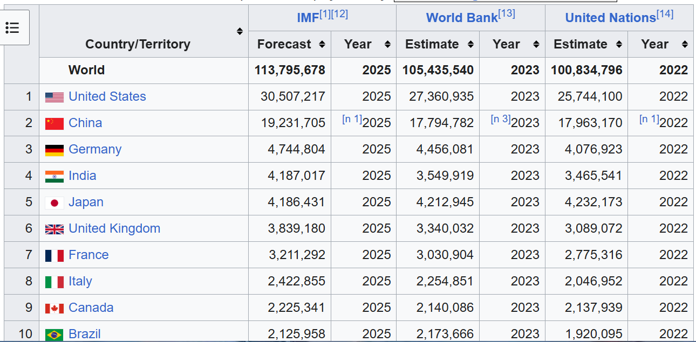

# 🌍 Global GDP Data Scraper & Cleaner

This project scrapes the **List of countries by GDP (nominal)** from Wikipedia, cleans the data, and saves it as a clean `.csv` and `.xlsx` file for analysis.

> 📊 Ideal for Tableau, Excel, Python analytics, and more!

---

## 📷 Screenshots

| Wikipedia Table Source | Cleaned Output Preview |
|------------------------|------------------------|
|  |  |

---

## 🧠 Features

- 🌐 Scrapes the latest GDP data from [Wikipedia](https://en.wikipedia.org/wiki/List_of_countries_by_GDP_(nominal))
- 🧹 Cleans messy formatting, removes citations like `[1]`, and drops nulls
- 📁 Saves clean data to:
  - `cleaned_data.csv`
  - `cleaned_data.xlsx`
- 💡 Supports direct import into Tableau and Excel

---

## 🛠️ Technologies Used

- `Python`
- `pandas`
- `BeautifulSoup`
- `requests`
- `re` (regex)
- `openpyxl` (for Excel output)

---

## 📂 How to Run

### 1. Install Requirements
```bash
pip install pandas requests beautifulsoup4 lxml openpyxl
python WebScrap.py ```
